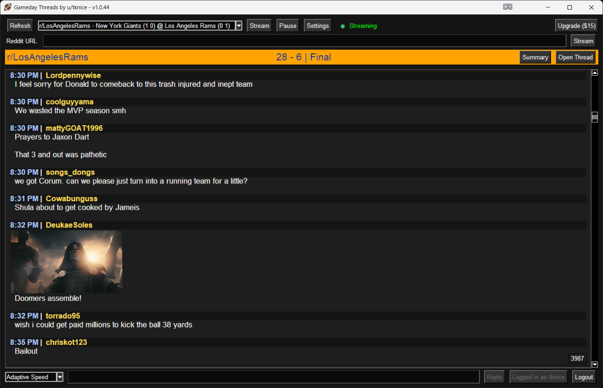
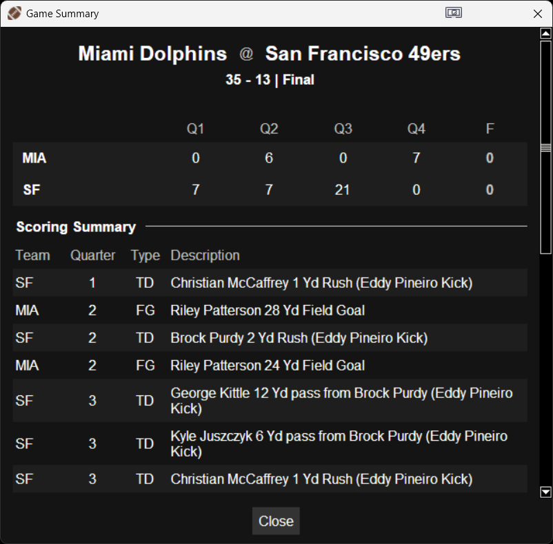
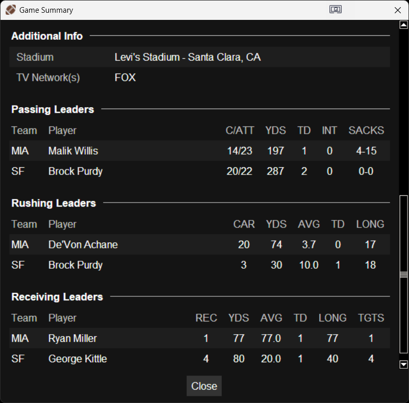
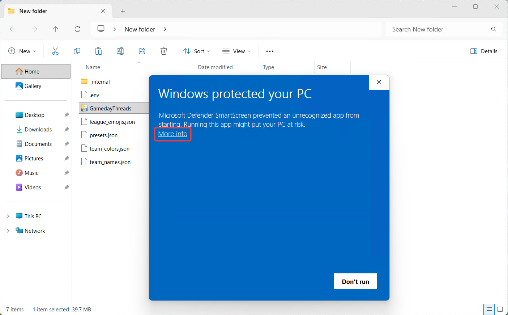
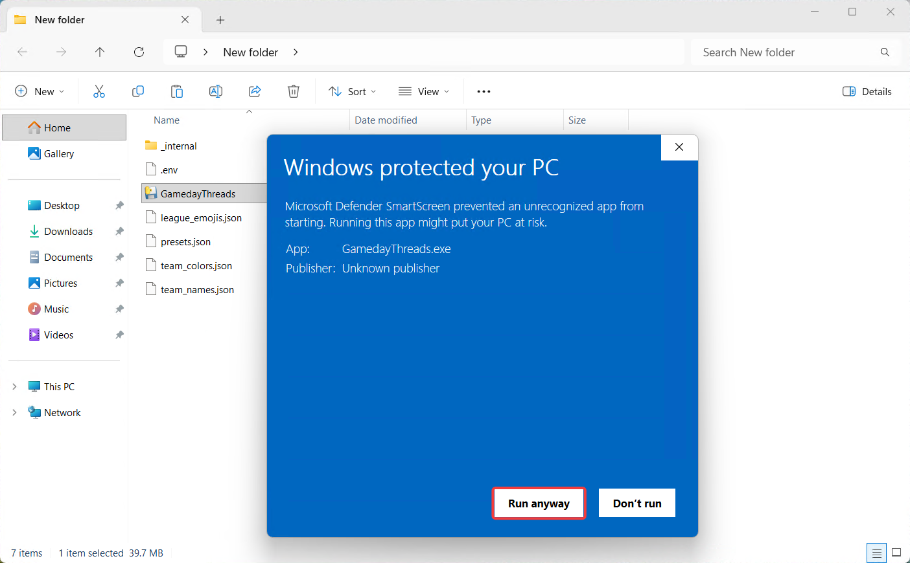
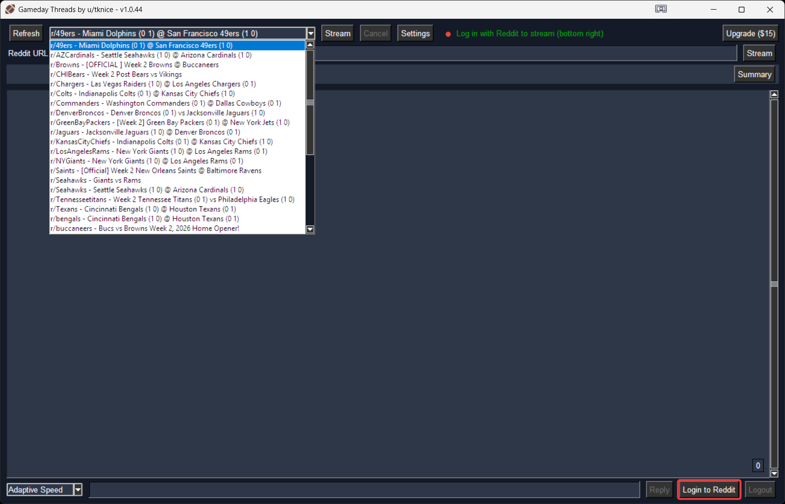
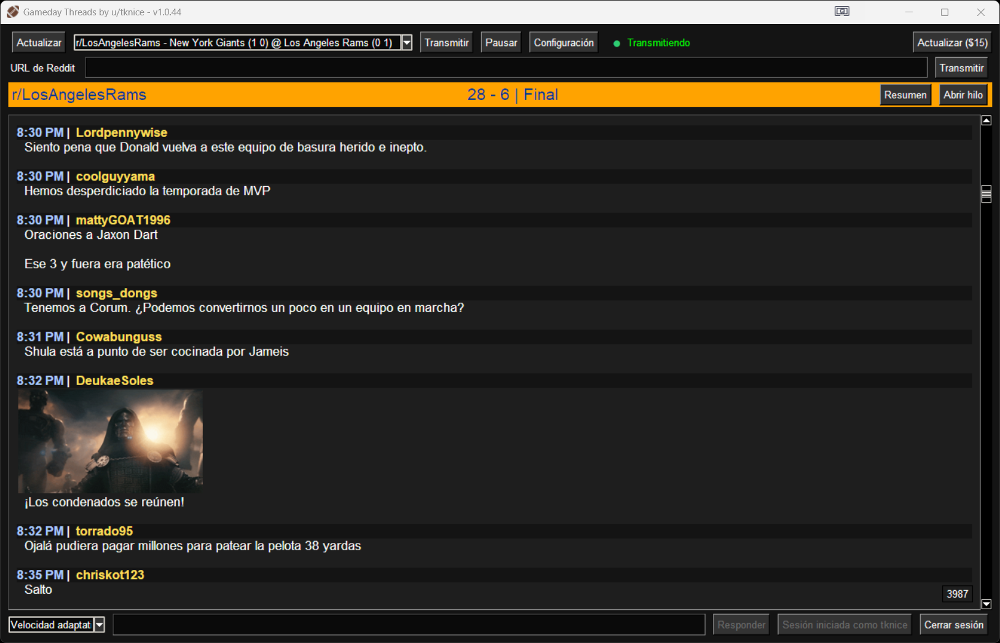
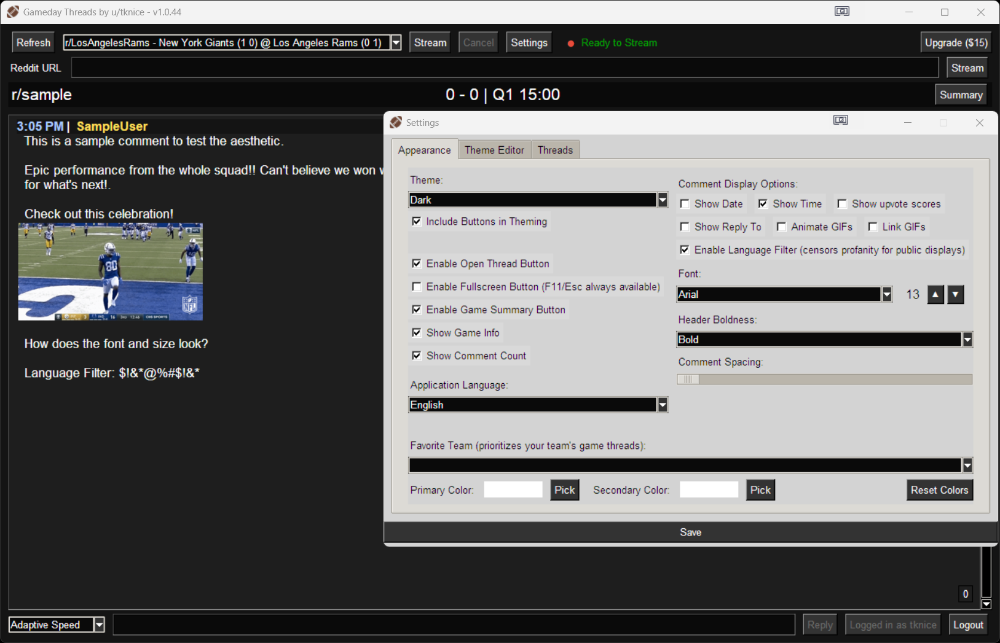
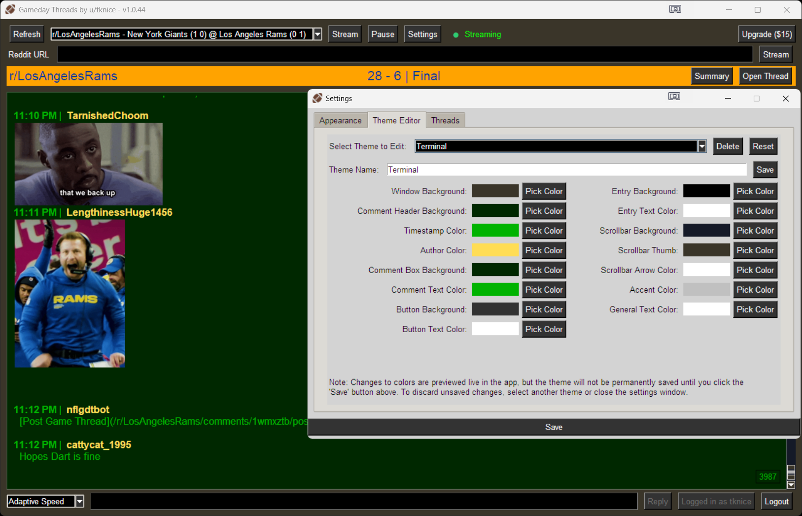
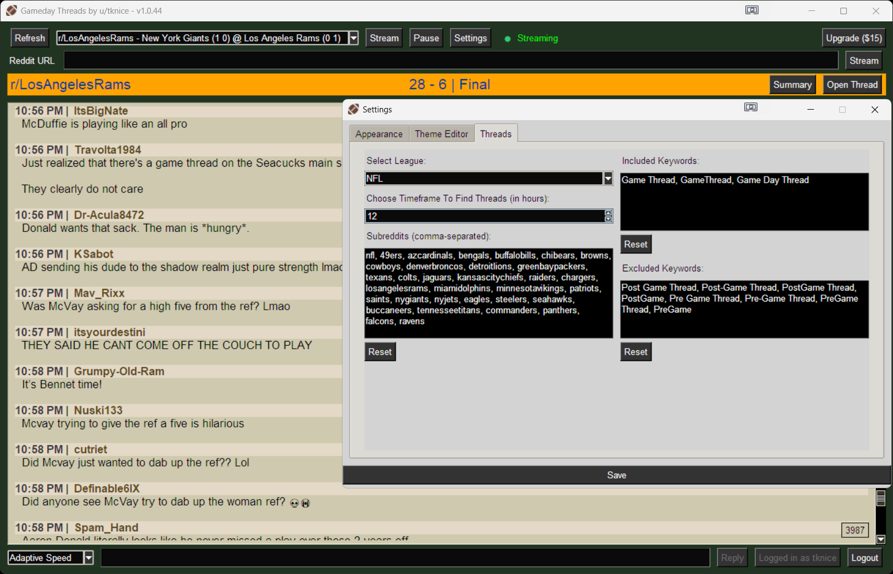

# Gameday Threads

Stream game day Reddit threads for all of your favorite sports teams — a Windows desktop app that pulls live game discussions from major sports subreddits into one clean, readable stream.

(more screenshots below)

## Core Functionality

**Thread Discovery** — Automatically finds recent game threads using configurable keywords and timeframes (default 12 hours), prioritizing your favorite teams and leagues.

**Live Comment Streaming** — Real-time comments with adjustable update speed (including an Adaptive Speed mode that automatically slows down during a comment rush so it stays readable, then catches back up as things quiet down), timestamps, author names, upvote scores, and reply indicators showing who each comment is replying to.

**Multi-Tab Streaming** (Premium) — Stream up to 3 threads at once in separate tabs, each running independently — perfect for following several games at the same time. Drag tabs to reorder them.

**Game Summary** — A detailed popup summarizing the game in progress: a full scoreboard with box score by quarter (and overtime, when it happens), plus a Scoring Summary when the thread includes one. NFL games also get Passing, Rushing, and Receiving Leaders tables when present.

  
  

**GIF Handling** — Reddit's embedded GIFs show as static thumbnails right in the comment stream by default (click to open the full GIF in your browser). Optionally, have them play automatically inline instead, or reduce them to plain text links instead.

**Multi-Language Translation** — Comments can be translated on the fly into Spanish, French, or Brazilian Portuguese (in addition to English), with an optional language filter to censor profanity for public displays. The entire app UI — menus, dialogs, the Game Summary popup — is translated too, not just the comments.

## Customization

- **Themes & Colors** — 15 built-in themes (Dark, Light, Slate, Onyx, Terminal, Veteran, Medieval, Crimson, Copper, Midas, Rose Gold, Sapphire, Emerald, Amethyst, Turquoise), plus custom color pickers for individual UI elements if you want to build your own
- **Typography** — Adjustable font size (8–24pt), boldness, and line spacing
- **Display Options** — Toggle timestamps, scores, Compact Mode, and profanity filtering
- **GIF Display** — Static thumbnail (default), inline animated playback, or link-only
- **Favorite Team Support** — Prioritize specific teams with custom color schemes, tracked separately per league (your NFL pick and your College Football pick don't overwrite each other)
- **Feed Only** — Hides everything but the comment feed and reply box (score banner, thread controls, login status), down to just the stream itself. Toggle it with the Feed Only button or `Ctrl+Shift+S` from anywhere — handy since the button itself is one of the things it hides

## Supported Leagues

NFL, NBA, MLB, NHL, MLS, and College Football (CFB) — including the r/CFB hub plus dedicated subreddits for major programs — each with preset configurations and room for custom subreddits/keywords.

## Free vs. Premium

Thread discovery, live streaming, game summaries, translation, all customization, and every supported league are free. A free Reddit login is required to stream (this keeps the app within Reddit's API limits as usage grows); no purchase is required for any of it.

**Premium ($15, one-time)** unlocks:
- Posting your own comments directly into the thread, rather than just reading along
- Multi-tab streaming — follow up to 3 threads at once instead of just one

Licensed through Gumroad, good for up to 3 device activations.

## Technical Details

Built with threaded operations to stay responsive, 5-minute caching on thread lists, automatic API retries with backoff, and persistent settings across sessions.

**Usage analytics:** Gameday Threads sends anonymous, aggregate usage data (app version, whether you're on Free or Premium, which league you're using, and your OS) to help guide development — for example, deciding which leagues or features are worth investing more in. This isn't tied to your Reddit username, license key, or email, and never includes comment content or thread details. It's identified only by a random ID generated on your device. Questions about this? Reach out at notifygamethreads@gmail.com.

## Installation

Download the latest release from the [Releases page](../../releases). No installer required — unzip and run `GamedayThreads.exe`.

**A note on first launch:** Windows may show a "Windows protected your PC" SmartScreen warning, since this is an independently-developed app not yet signed with a commercial code-signing certificate. This is expected, not a sign anything's wrong. To run it: click **"More info"**, then **"Run anyway."** This only happens once per version.

  
  

## How to Use
- Log in with Reddit (bottom right) — a free Reddit account, no special permissions needed. This is required before streaming. Login uses Reddit's own OAuth page, so you authorize the connection there — you never type your Reddit password into this app.

  
- Select a league on application startup.
- Select a thread and stream comments.
- By default, the timeframe to include threads is 12 hours, which will pull in all games or matches happening today. Under Settings > Threads, you can select an older timeframe (in hours) to find more.
- Premium users can click the **+** next to the tab strip to open another thread in a new tab (up to 3 at once), and drag tabs to reorder them.
- For help, see settings or report issues below.

## Report Issues
Found a bug? Create an issue [here](https://github.com/tknice/gameday-threads/issues).

## Screenshots

**License**: Proprietary software, free to use for browsing/streaming; see [license.txt](license.txt) for full terms. Questions: notifygamethreads@gmail.com

© 2025 tknice. All rights reserved. Unauthorized copying prohibited.
